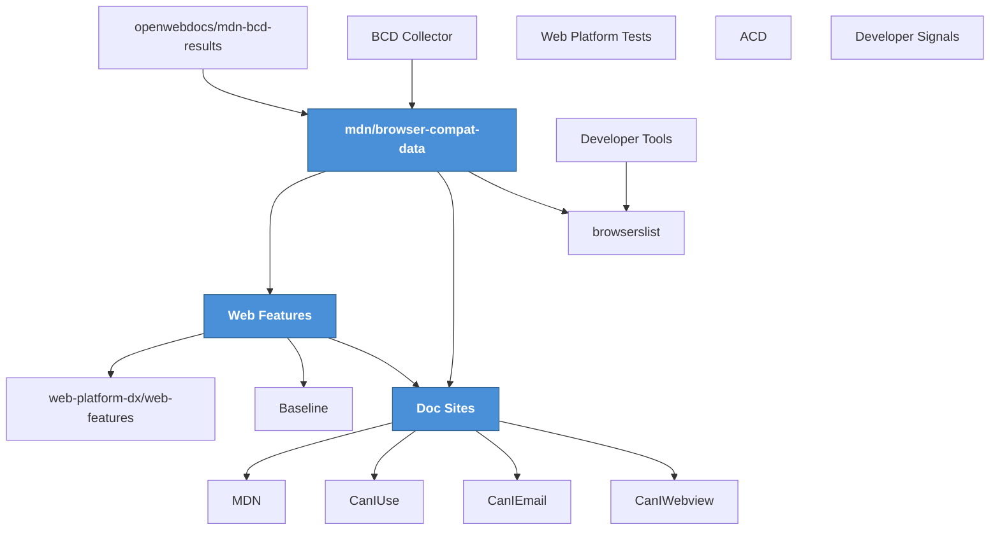

# web compat tools

```mermaid
graph TD
  BCD["mdn/browser-compat-data"]
  bcdresults["openwebdocs/mdn-bcd-results"] --> BCD
  BCDCollector[BCD Collector] --> BCD
  BCD --> WebFeatures[Web Features]
  WebFeatures --> webPlatformDX["web-platform-dx/web-features"]
  WebFeatures --> Baseline
  DocSites[Doc Sites]
  DocSites --> MDN
  DocSites --> CanIUse
  DocSites --> CanIEmail
  DocSites --> CanIWebview
  WPT[Web Platform Tests]
  ACD
  DevSignals[Developer Signals]
  DevTools[Developer Tools]
  DevTools --> browserslist

  BCD ----> DocSites
  WebFeatures --> DocSites
  BCD --> browserslist

  classDef toolchain fill:#4a90d9,stroke:#2c5f8a,color:#fff,font-weight:bold
  class BCD,WebFeatures,DocSites toolchain
```