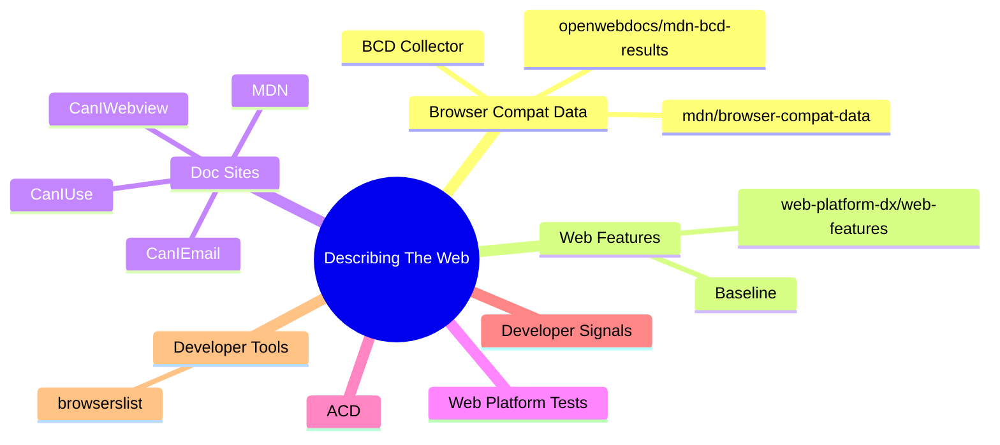

# web compat tools

```mermaid
mindmap
  root((Describing The Web))
    Browser Compat Data
      BCD Collector
      mdn/browser-compat-data
      openwebdocs/mdn-bcd-results
    Web Features
        web-platform-dx/web-features
        Baseline
    Doc Sites
        MDN
        CanIUse
        CanIEmail
        CanIWebview
    Web Platform Tests
    ACD
    Developer Signals
    Developer Tools
        browserslist
```